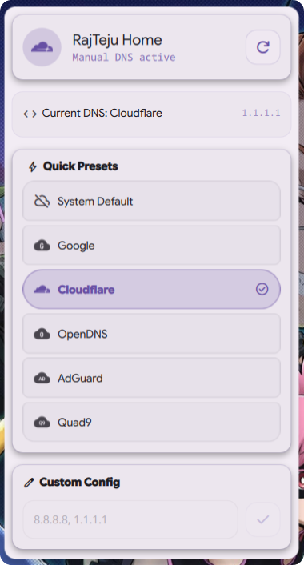
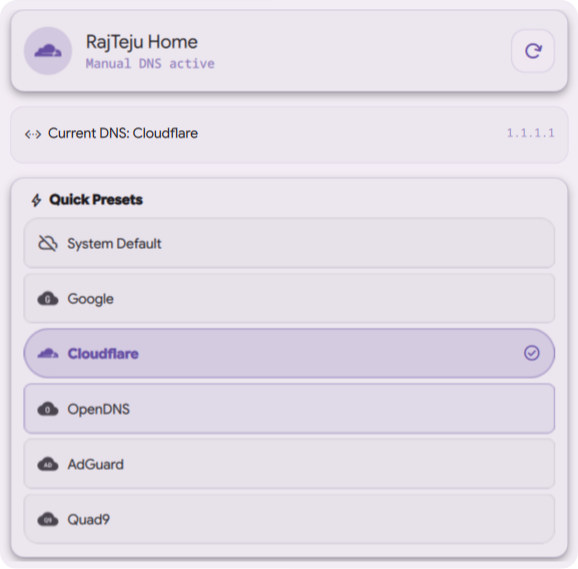
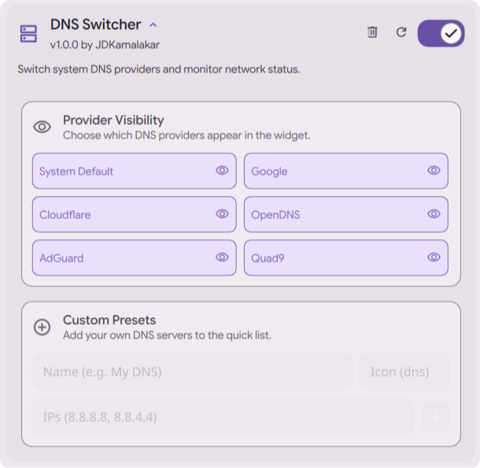

# DNS Switcher [App](#)

### Premium DNS Management
Monitor and switch your system DNS providers – easier than ever on the Dank Material Shell.

## Download

*Requires Dank Material Shell (DMS) 1.0 or higher.*

## Features

* **Instant Switching**: One-click toggling between Google, Cloudflare, OpenDNS, and more.
* **Real-time Monitoring**: Live status of your current DNS provider and active connection.
* **Custom Configuration**: Add your own DNS servers with personalized names and icons.
* **Material Aesthetics**: Smooth animations and transitions that feel native to DMS.
* **Multi-Widget Support**: Compact pills for panels and a full Control Center detail view.
* **Deep Settings**: Full control over provider visibility and custom configurations.

## Interface

  
  

## Configuration

  

## Contributing

Pull requests are welcome. For major changes, please open an issue first to discuss what you would like to change.

Before reporting a new issue, take a look at the [FAQ](https://github.com/JDKamalakar/DMS-DNS_Switcher/wiki), the [changelog](https://github.com/JDKamalakar/DMS-DNS_Switcher/releases) and the already opened [issues](https://github.com/JDKamalakar/DMS-DNS_Switcher/issues).

### Credits

Built with ❤️ for the [Dank Material Shell](https://github.com/DankMaterialShell) community.

### Disclaimer

The developer(s) of this application does not have any affiliation with the DNS providers listed, and this application only provides a UI for system settings.

### 📜 License

Part of DankMaterialShell. Check the main repository for license information.

